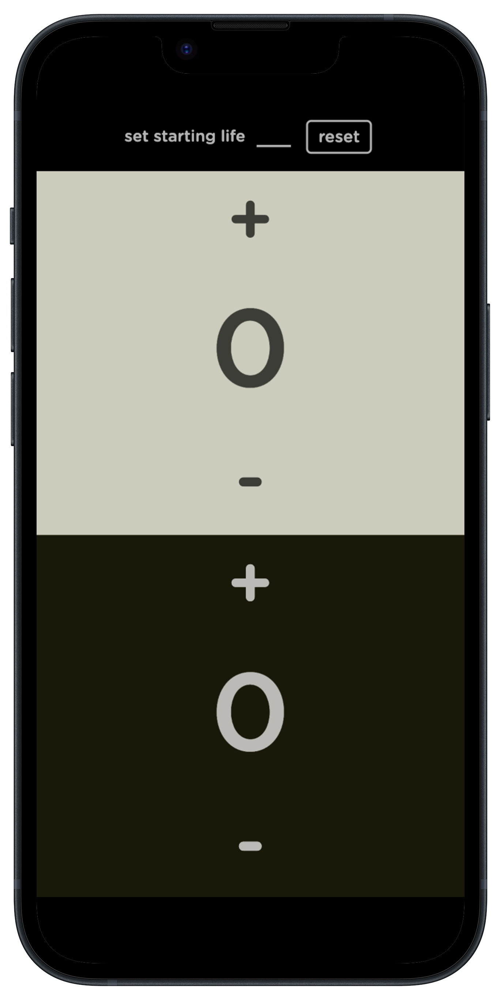

# Life Counter
> Perfect life counter for your game nights!

## Usage example

Introducing our new Life Counter app, designed with a sleek and minimalistic interface for your game nights. With a user-friendly design, it simplifies scorekeeping and enhances your tabletop gaming experience.

Minimal Design: Distraction-free, keeping the focus on your game.
Easy-to-Use: Quickly set starting life totals and update scores.
Versatile: Customize it for various tabletop games.
Math-Free: No more mental arithmetic; the app does the work.
Elevate your gaming nights, reduce errors, and keep everyone engaged in the game.

## Developer

Giuseppe Vassallo – www.linkedin.com/in/giuseppe-vassallo-a24885291 –

[https://github.com/vax-9/Life-Counter](https://life-counter-giuseppe-vassallo.netlify.app/)

## Contributing

1. Fork it (<https://github.com/vax-9/Life-Counter/fork>)
2. Create your feature branch (`git checkout -b feature/newFeature`)
3. Commit your changes (`git commit -am 'Add some newFeature'`)
4. Push to the branch (`git push origin feature/newFeature`)
5. Create a new Pull Request
